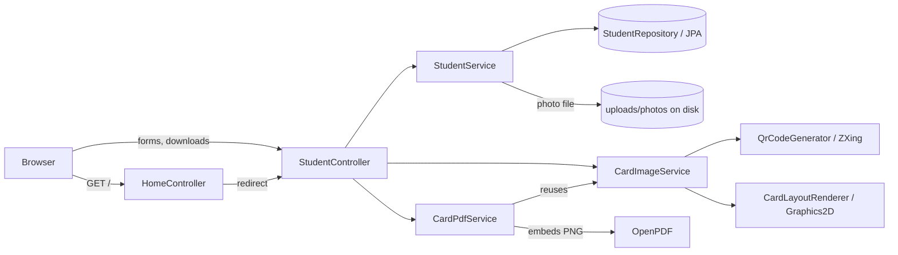

# ID Card Generator

Generate college ID cards as PNG and PDF from one Java2D layout, with a QR code on each card.

[](pom.xml)
[](pom.xml)

**Live demo:** https://idcard-generator-phn7.onrender.com
(Free tier: the service sleeps after 15 minutes idle, so the first request can take about a minute.)

<!-- TODO: add a screenshot or GIF at docs/images/demo.gif and reference it here -->

## The Problem

Projects that export the same design as both an image and a PDF usually end up with two layout implementations. They drift apart, and the PDF stops matching the PNG.

This project draws the card once. The PDF is that same rendered image placed on a PDF page, so the two exports cannot disagree.

## Key Features

- Register a student (name, roll number, department, course, date of birth, valid-till date) with a photo upload.
- Download the card as **PNG** or **PDF** from a single rendering path.
- Every card carries a QR code that encodes `STUDENT-ID:<id>`.
- A card with no photo renders a placeholder instead of failing.
- Long field values are truncated to 24 characters so the layout never overflows.
- No separate frontend build: pages are server-rendered with Thymeleaf.
- The same code runs on H2 (local) or PostgreSQL (production), selected by environment variables.

## Quickstart

**Prerequisites:** JDK 17, Maven 3.9+.

```bash
git clone https://github.com/bonamukkala-bot/idcard-generator.git
cd idcard-generator
mvn spring-boot:run
```

Expected output ends with:

```
Tomcat started on port 8080 (http) with context path '/'
Started IdCardGeneratorApplication in ~3 seconds
```

Open http://localhost:8080. It redirects to the registration form. Register a student, then use the **PDF** or **Image** link on the list page.

Locally the app uses an in-memory H2 database, so data is lost on restart. No configuration is needed.

**With Docker** (Docker Desktop must be running):

```bash
docker build -t idcard-generator .
docker run -p 8080:8080 idcard-generator
```

<details>
<summary>Troubleshooting</summary>

- `Web server failed to start. Port 8080 was already in use.` An earlier instance is still running. On Windows PowerShell, find it with `Get-NetTCPConnection -LocalPort 8080 | Select-Object -ExpandProperty OwningProcess`, then stop it with `Stop-Process -Id <PID> -Force`.
- `failed to connect to the docker API ...` Docker Desktop is not running. Start it and retry.
- `mvn` or `java` not recognized after installing. Open a new terminal, or restart VS Code or Windows, so the updated PATH is picked up.

</details>

## Architecture



**One request end to end: `GET /students/{id}/card.pdf`**

1. `StudentController` loads the student through `StudentService`.
2. `CardPdfService` calls `CardImageService.renderCard()`.
3. `CardImageService` reads the photo from disk (if present) and generates a 300x300 QR for `STUDENT-ID:<id>`.
4. It creates a 638x1013 `BufferedImage` and passes it to `CardLayoutRenderer.draw()`, the only place layout code lives.
5. `CardPdfService` encodes that image as PNG and places it on a PDF page of the same dimensions with OpenPDF.
6. The controller returns the bytes as `application/pdf` with a download header.

The PNG endpoint does steps 1 to 4, then writes the image to the response.

## Design Decisions & Trade-offs

- **One shared renderer over separate PNG and PDF layouts.** The two outputs cannot drift. Cost: the PDF contains a raster image at 638x1013 px, not vector text, so it is not suited to high-resolution print.
- **Server-rendered Thymeleaf over a JavaScript SPA.** No frontend build step, and the whole app is Java plus a little vanilla JS. Cost: rich interactivity has to be hand-written JS.
- **Datasource from environment variables with H2 defaults over Spring profiles.** The same artifact runs locally with zero setup and in production with Postgres. Cost: H2-specific settings such as the console flag stay in the config in every environment.
- **Docker deployment on Render over a native runtime.** Java was not among Render's automatic runtimes when I set this up, so the multi-stage `Dockerfile` (Maven build stage, JRE-only run stage) is what Render builds. Cost: every deploy rebuilds the image and re-downloads Maven dependencies (about 3 minutes on the free tier).
- **Photos on local disk over object storage.** Simplest thing that works. Cost: on Render's free tier the filesystem is ephemeral, so photos are lost on restart or redeploy.

## Tech Stack

| Layer | Choice | Why |
|---|---|---|
| Framework | Spring Boot 3.3.4 (Web, Data JPA, Thymeleaf) | Routing, dependency injection, server-rendered pages |
| Language | Java 17 | Required by Spring Boot 3 |
| Database | PostgreSQL (prod), H2 (local) | Swapped by environment variables |
| Card drawing | Java 2D (`Graphics2D`) | Layout in plain Java, no design-tool dependency |
| PDF | OpenPDF 1.3.39 | Embeds the rendered card in a PDF page |
| QR codes | ZXing 3.5.3 | Pure-Java QR generation, no external service |
| Build / deploy | Maven, Docker, Render | Multi-stage image; Render builds from `main` |

## Project Structure

```
.
├── Dockerfile                      # multi-stage: Maven build -> JRE run
├── pom.xml
└── src/main/
    ├── java/com/charan/idcard/
    │   ├── controller/             # StudentController, HomeController
    │   ├── model/                  # Student (JPA entity)
    │   ├── repository/             # StudentRepository
    │   └── service/                # renderer, PNG/PDF services, QR, student + photo storage
    └── resources/
        ├── templates/              # register.html, list.html
        ├── static/css/             # style.css
        └── application.properties
```

`uploads/photos/` is created at runtime and is git-ignored.

## Configuration

| Variable | Required | Default | Description |
|---|---|---|---|
| `SPRING_DATASOURCE_URL` | No | `jdbc:h2:mem:idcarddb` | JDBC URL. For Postgres: `jdbc:postgresql://<host>:5432/<db>` |
| `SPRING_DATASOURCE_DRIVER` | For Postgres | `org.h2.Driver` | Set to `org.postgresql.Driver` for Postgres |
| `SPRING_DATASOURCE_USERNAME` | For Postgres | `sa` | Database user |
| `SPRING_DATASOURCE_PASSWORD` | For Postgres | empty | Database password |
| `PORT` | No | `8080` | HTTP port (Render sets this automatically) |

Fixed in `application.properties`: `app.upload.dir=uploads/photos`, upload limit 10 MB, `spring.jpa.hibernate.ddl-auto=update`. Standard Spring Boot externalized configuration can override them.

<details>
<summary>Deploying to Render (how the live demo is set up)</summary>

1. Create a Render **Postgres** instance (free plan) in a region.
2. Create a **Web Service** from this GitHub repo, language **Docker**, same region, free instance type.
3. Add the four `SPRING_DATASOURCE_*` variables above, using the database's **Internal** connection details (converted to the JDBC form).
4. Deploy. Later pushes to `main` redeploy automatically.

</details>

## Usage / API Reference

| Method | Path | Description |
|---|---|---|
| GET | `/` | Redirects to `/students/new` |
| GET | `/students/new` | Registration form |
| POST | `/students` | Create a student (multipart), then redirect to `/students` |
| GET | `/students` | List students with download links |
| GET | `/students/{id}/card.png` | Card as PNG (attachment) |
| GET | `/students/{id}/card.pdf` | Card as PDF (attachment) |

Register a student from the command line:

```bash
curl -i -X POST http://localhost:8080/students \
  -F fullName="Asha Rao" -F rollNumber="CS-001" \
  -F department="Computer Science" -F course="B.Tech" \
  -F dateOfBirth="2005-01-15" -F validTill="2029-06-30" \
  -F photo=@photo.jpg
```

Download the card:

```bash
curl -o card.png http://localhost:8080/students/1/card.png
curl -o card.pdf http://localhost:8080/students/1/card.pdf
```

`rollNumber` has a unique constraint. `fullName` and `rollNumber` are required.

## Testing & CI

There are no automated tests and no CI workflow yet. `spring-boot-starter-test` is on the classpath but no test sources exist. Verification so far has been manual: register a student, download both formats, and check the card visually.

## Known Limitations & Roadmap

**Limitations**

- **No authentication.** Every endpoint is public, and IDs are sequential.
- **The QR is not verifiable yet.** It encodes `STUDENT-ID:<id>` and there is no `/verify/{id}` endpoint, although the card says "scan to verify".
- **Photos are ephemeral on Render's free tier** (see Design Decisions).
- **Free-tier limits.** The web service sleeps when idle, and the free Postgres instance expires 30 days after creation.
- **Upload handling is minimal.** File type is only restricted client-side (`accept="image/*"`), and filenames are not sanitized on the server.
- **Error handling is default.** A duplicate roll number or an unknown student ID is not mapped to a friendly response. `StudentService.getById` throws `IllegalArgumentException` rather than returning 404.
- **Dates are stored as strings**, and the H2 console is enabled in every environment's config.

**Roadmap**

- [ ] Graceful errors for duplicate roll numbers, missing students and oversized uploads
- [ ] `/verify/{id}` endpoint that the QR code links to
- [ ] Object storage for photos (S3 or Cloudinary)
- [ ] Spring Security for admin access
- [ ] Tests and a GitHub Actions workflow
- [ ] Batch import from CSV

## Contributing

Issues and pull requests are welcome. Please open an issue first to discuss larger changes, and include steps to reproduce for bug reports.

## License

TODO: no license file exists yet. Choose one and add a `LICENSE` file.

## Author

Charan Bonamukkala, [@bonamukkala-bot](https://github.com/bonamukkala-bot)
